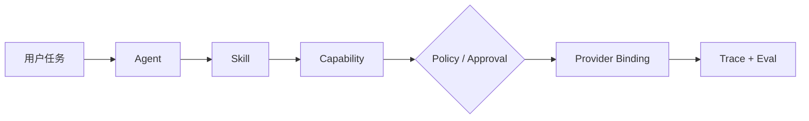

# Vertical Agent Factory

一套 **Capability-first（能力优先）** 的垂直领域 Agent 工厂：用共享 Harness 承载运行时、策略、审批、追踪和评测，再通过可版本化的 Domain Pack 安装领域知识、任务、Skill、工作流与输出契约。

[在线可视化实验室](https://vertical-agent-factory-lab.xuchong1999.chatgpt.site) · [金融 Agent 工作台](https://vertical-agent-factory-lab.xuchong1999.chatgpt.site/finance) · [金融 Agent 与微信接入](docs/FINANCE_AGENT_AND_WECHAT.md) · [无代码配置中心](https://vertical-agent-factory-lab.xuchong1999.chatgpt.site/setup) · [全面自测试报告](docs/SELF_TEST_REPORT.md) · [详细使用手册](docs/USAGE.md) · [商业 API](docs/COMMERCIAL_API.md) · [模型前三档](docs/MODEL_TIERS.md) · [架构说明](docs/ARCHITECTURE.md)

## 它解决什么问题

传统做法会为每个业务领域复制一套 Agent 运行时，导致工具绑定、权限边界和质量标准逐渐分叉。Vertical Agent Factory 将稳定的平台能力与变化的领域资产分离：



- **Agent**：决定谁负责、允许处理哪些任务。
- **Skill**：描述怎样完成任务，不硬编码供应商工具。
- **Capability**：稳定的语义能力契约。
- **Provider Binding**：把能力解析到本地实现、MCP 或外部 API。
- **Policy / Approval**：在副作用发生前执行允许、拒绝或审批。
- **Trace / Eval**：记录完整决策链，并用 Golden Cases 持续回归。

## 当前包含

- 可执行 Python Harness：包加载、校验、能力解析、策略、审批、工作流、Trace 和 Eval。
- `research` 与 `finance` 两个 Domain Pack；金融包覆盖宏观、A 股、美股和受审批保护的简报发布。
- 60 个跨领域 Golden Evals、76 个 Python 自动化测试。
- 交互式 Web UI：系统运行链、金融研究工作台，以及面向非技术用户的五步 Agent/数据源/微信公众号配置向导。
- 多租户商业 REST API：API Key、限流、配额、计量、幂等，以及 16 个中国模型 Provider 和 3 个国际厂商适配。
- 微信公众号通道：服务器签名校验、明文 XML、命令路由、幂等被动文本回复；不开放主动群发或交易。
- 领域包规范、模板目录、维护流程与验收清单。

## 商业 API

外部客户可以通过统一的 `/v1/agent/runs` 调用 Agent，服务端再按租户 allowlist 选择本地、OpenAI、Anthropic、Gemini，或 Qwen、DeepSeek、GLM、Kimi、MiniMax、豆包、混元、千帆等 16 个中国 Provider。客户不会获得厂商密钥，也不能在请求中自行批准写操作。

```powershell
python -m pip install -e ".[api]"
Copy-Item config/commercial.example.yaml config/commercial.yaml
$env:VAF_API_KEY_DEMO = "replace-with-a-long-random-customer-key"
vertical-agent-api
```

非技术用户可直接使用[无代码配置中心](https://vertical-agent-factory-lab.xuchong1999.chatgpt.site/setup)并按[无代码配置手册](docs/NO_CODE_SETUP_UI.md)完成；手工部署请按[商业 API 逐步配置手册](docs/COMMERCIAL_SETUP_STEP_BY_STEP.md)操作。接口原理与生产要求见[商业 API 接入与部署](docs/COMMERCIAL_API.md)；当前厂商模型档位、例外和更新流程见[模型前三档配置](docs/MODEL_TIERS.md)。

## 5 分钟快速开始

要求：Python 3.7+；运行 Web UI 还需要 Node.js 22.13+ 和 pnpm 11。

```powershell
git clone https://github.com/270438469/vertical-agent-factory.git
cd vertical-agent-factory

python -m pip install -e .
vertical-agent --root . validate --domain research
vertical-agent --root . run --domain research `
  --task research.answer.query --input "query=shared Harness"
vertical-agent --root . eval --domain research
```

也可以不安装命令入口，直接使用模块：

```powershell
python -m vertical_agent_factory.cli --root . validate --domain research
```

写操作默认经过审批门：

```powershell
# 返回 approval_required，不执行写入
vertical-agent --root . run --domain research `
  --task research.report.publish --input "target=demo"

# 显式批准后执行示例 Provider
vertical-agent --root . run --domain research `
  --task research.report.publish --input "target=demo" `
  --approve research.report.publish
```

每次运行的 JSONL Trace 保存在 `.runs/<run-id>.jsonl`，可还原 Agent、Skill、Capability、Policy、Binding 与工作流状态。

## 启动可视化 UI

```powershell
cd web
pnpm install
pnpm run dev
```

打开终端显示的本地地址，或直接访问[在线版本](https://vertical-agent-factory-lab.xuchong1999.chatgpt.site)。系统地图用于架构讲解与场景模拟；`/setup` 配置中心只有在用户明确连接本机配置服务并点击应用时，才会把配置写入本机。

## 自测试

```powershell
python -m pip install -e ".[api,api-test]"
python -m pytest -q
python -m vertical_agent_factory.cli --root . validate --domain research
python -m vertical_agent_factory.cli --root . eval --domain research

cd web
pnpm run lint
pnpm test
```

当前基线：76 个 Python 测试、60/60 Golden Evals、4 个服务端渲染 HTML 测试，生产构建与 lint 通过。

## 项目结构

```text
vertical_agent_factory/   共享 Harness 与 CLI
vertical_agent_factory/commercial/  多租户商业 API
domains/research/         领域定义、知识、任务、Schema、工作流
domains/finance/          宏观、A 股、美股任务、Schema 与工作流
agents/research/          Agent Manifest 与系统约束
agents/finance/           金融研究 Agent 与安全边界
skills/research/          Skill 契约与执行说明
capabilities/             语义能力注册
mcp/bindings/             Capability 到 Provider 的绑定
policies/                 权限与审批策略
evals/                    Golden Cases
tests/                    Python 系统测试
web/                      可视化实验室
docs/                     使用、架构与扩展文档
config/                   商业 API 配置示例
```

## 从这里继续

- 第一次运行：阅读[详细使用手册](docs/USAGE.md)。
- 运行金融 Agent 或接微信公众号：阅读[金融分析 Agent 与微信公众号接入手册](docs/FINANCE_AGENT_AND_WECHAT.md)。
- 不写代码配置 Agent：使用[无代码配置中心](https://vertical-agent-factory-lab.xuchong1999.chatgpt.site/setup)并阅读[无代码配置手册](docs/NO_CODE_SETUP_UI.md)。
- 对外提供服务：阅读[商业 API 接入与部署](docs/COMMERCIAL_API.md)。
- 理解执行链：阅读[架构说明](docs/ARCHITECTURE.md)。
- 创建新垂直领域：阅读[Domain Pack 搭建指南](docs/DOMAIN_PACK_GUIDE.md)。
- 查阅完整规范：从[总体框架](01-VERTICAL_AGENT_FRAMEWORK.md)和[领域包规范](02-DOMAIN_PACKAGE_SPEC.md)开始。

## 安全边界

示例 `research` Provider 是本地模拟实现，不会执行真实外部写入。接入真实 MCP、数据库或业务 API 时，应把凭据留在运行环境中，并保持写操作的 Policy、Approval、幂等键和审计 Trace；不要把密钥提交到 Domain Pack。
