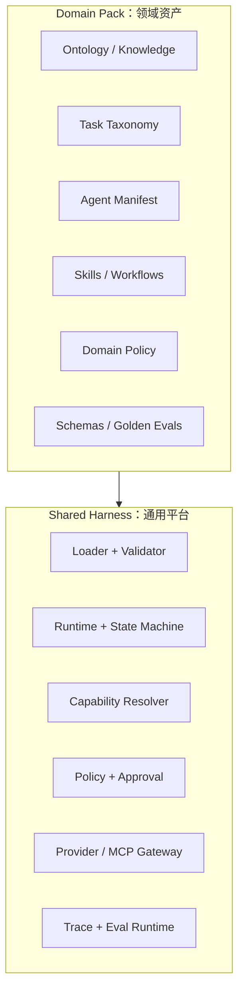
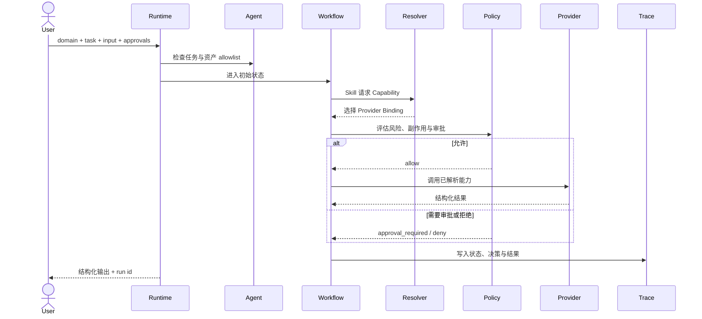

# 架构说明

Vertical Agent Factory 将“稳定的执行基础设施”与“持续变化的领域资产”分开。新增领域时安装 Domain Pack，不复制 Harness。

## 分层模型

通用平台负责可靠、安全地执行；领域包负责告诉平台“这个领域是什么、能做什么、怎样判断做对了”。

## 一次任务如何运行

关键顺序是 **先策略、后副作用**。Skill 只声明语义 Capability，Resolver 再根据绑定选择具体实现，因此替换供应商不需要改写业务流程。

## 核心组件

| 组件 | 责任 | 主要位置 |
| --- | --- | --- |
| Loader / Validator | 加载 YAML、JSON 与 Markdown 资产，检查交叉引用 | `vertical_agent_factory/loader.py`, `validation.py` |
| Runtime | 执行任务、工作流状态机和失败路径 | `vertical_agent_factory/runtime.py` |
| Capability Resolver | 从语义能力选择 Provider Binding | `vertical_agent_factory/resolver.py` |
| Policy Engine | 处理 allow、deny 与 approval required | `vertical_agent_factory/policy.py` |
| Provider Gateway | 执行本地模拟 Provider；可扩展到 MCP/API | `vertical_agent_factory/providers.py` |
| Trace | 将运行事件写入 JSONL | `vertical_agent_factory/trace.py` |
| Eval Runtime | 执行 Golden Cases 并比较预期结果 | `vertical_agent_factory/evals.py` |

## Domain Pack 契约

一个完整领域由以下可版本化资产组成：

- `domains/<id>/domain.yaml`：领域范围、用户、自治级别、风险与所有者。
- `domains/<id>/ontology.yaml`：实体、关系和领域语言。
- `domains/<id>/task-taxonomy.yaml`：任务、风险、所需能力、工作流和完成条件。
- `agents/<id>/agent.yaml`：Agent 对 Task、Skill、Capability 和 Policy 的 allowlist。
- `skills/<id>/<skill>/skill.yaml`：Skill 输入输出与 Capability 依赖。
- `capabilities/<id>.yaml`：稳定的语义能力契约。
- `mcp/bindings/<id>.yaml`：Capability 到 Provider 的实现映射。
- `policies/<id>/default.yaml`：自治和副作用边界。
- `domains/<id>/workflows/*.yaml`：显式状态机。
- `evals/<id>/golden.yaml`：正向、拒绝、审批、故障与证据不足用例。

## 失败与安全语义

系统把关键失败保留为可区分状态：

- `validation_error`：领域包结构或引用不完整。
- `capability_unresolved`：没有合适的 Provider Binding。
- `policy_denied`：策略明确禁止。
- `approval_required`：存在副作用，但缺少批准。
- `provider_error`：Provider 不可用或返回失败。
- `insufficient_evidence`：无法形成可追溯结论。

这些状态既进入 Trace，也应进入 Golden Evals。这样策略收紧、Provider 替换或工作流调整后，可以判断行为变化是否符合预期。

## 设计原则

1. **能力优先**：Skill 依赖语义能力，不依赖具体工具名。
2. **最小权限**：Agent、Skill、Capability 和 Policy 均显式 allowlist。
3. **副作用前置控制**：审批和策略判断必须早于外部写入。
4. **证据优先**：事实型任务将证据要求写入任务和输出契约。
5. **默认可追踪**：每次运行都产生可关联的状态与决策事件。
6. **评测即契约**：Golden Cases 同时覆盖成功和失败语义。

更完整的规范见[总体框架](../01-VERTICAL_AGENT_FRAMEWORK.md)与[领域包规范](../02-DOMAIN_PACKAGE_SPEC.md)。

