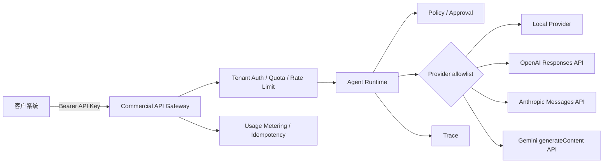

# 商业 API 接入与部署

商业 API 将内部 Agent Runtime 包装成一个稳定的多租户 REST 接口。外部客户只持有本系统签发的 API Key，不接触模型厂商密钥；服务端根据租户 allowlist 选择本地实现、OpenAI、Anthropic 或 Gemini。



厂商适配直接调用各厂商官方 HTTPS API：[OpenAI Responses](https://developers.openai.com/api/reference/resources/responses/methods/create)、[Anthropic Messages](https://docs.anthropic.com/en/api/messages)、[Gemini text generation](https://ai.google.dev/gemini-api/docs/text-generation)。

## 已实现的商业化基础能力

- Bearer API Key 多租户鉴权，密钥使用常量时间比较。
- 每个租户独立的 Domain、Task、Provider 和 Model allowlist。
- 厂商密钥只从服务端环境变量读取，不进入请求、配置文件或 Trace。
- 单实例分钟级限流和持久化月请求配额。
- SQLite 用量计量：请求、输入 Token、输出 Token、总 Token 与延迟。
- `Idempotency-Key` 重放保护，避免客户重试造成重复执行。
- 写操作不接受客户自带批准；审批能力只能由可信服务端配置授予。
- 标准化错误码、`Retry-After` 和 `X-Request-ID`。
- 默认 256 KiB 的 HTTP 请求体上限，可通过 `VAF_MAX_REQUEST_BYTES` 调整。
- 自动生成 OpenAPI 文档：`/docs` 与 `/openapi.json`。

## 1. 安装

商业 API 建议使用 Python 3.12：

```powershell
python -m pip install -e ".[api]"
Copy-Item config/commercial.example.yaml config/commercial.yaml
```

不要直接在 YAML 中写任何真实密钥。先生成至少 32 字符的客户 API Key，再配置环境变量：

```powershell
$env:VAF_API_KEY_DEMO = "replace-with-a-long-random-customer-key"
$env:OPENAI_API_KEY = "..."     # 仅在启用 OpenAI 时设置
$env:ANTHROPIC_API_KEY = "..."  # 仅在启用 Anthropic 时设置
$env:GEMINI_API_KEY = "..."     # 仅在启用 Gemini 时设置
$env:VAF_COMMERCIAL_CONFIG = "config/commercial.yaml"
```

生产环境应使用云 Secret Manager、Vault 或容器 Secret 注入，不使用提交到仓库的 `.env` 文件。

## 2. 配置租户

`config/commercial.yaml` 的关键部分：

```yaml
tenants:
  - id: customer-a
    api_key_env: VAF_API_KEY_CUSTOMER_A
    allowed_domains: [research]
    allowed_tasks: [research.answer.query]
    allowed_providers: [local, openai]
    default_provider: local
    allowed_models:
      openai: [gpt-5-mini]
    default_models:
      openai: gpt-5-mini
    approved_capabilities: []
    rate_limit_per_minute: 60
    monthly_request_quota: 10000
```

模型名称只是租户 allowlist，应根据已经开通的厂商账户和成本策略维护。删除某个 Provider 或 Model 后，客户即使在请求里指定它也会收到 `403`。

`approved_capabilities` 默认必须为空。真实发布、付款、删改等操作应连接独立审批服务，不建议通过静态配置长期预批准。

## 3. 启动服务

```powershell
vertical-agent-api
```

默认只监听 `127.0.0.1:8000`。本地查看：

- Health：<http://127.0.0.1:8000/v1/health>
- Swagger UI：<http://127.0.0.1:8000/docs>
- OpenAPI：<http://127.0.0.1:8000/openapi.json>

## 4. 调用 Agent

使用本地 Provider：

```powershell
$headers = @{
  Authorization = "Bearer $env:VAF_API_KEY_DEMO"
  "Idempotency-Key" = "order-20260808-001"
}
$body = @{
  domain = "research"
  task = "research.answer.query"
  input = @{ query = "shared Harness" }
} | ConvertTo-Json -Depth 5

Invoke-RestMethod -Method Post `
  -Uri "http://127.0.0.1:8000/v1/agent/runs" `
  -Headers $headers -ContentType "application/json" -Body $body
```

选择租户允许的官方模型：

```json
{
  "domain": "research",
  "task": "research.answer.query",
  "input": {"query": "shared Harness"},
  "provider": "openai",
  "model": "gpt-5-mini"
}
```

外部模型只替换 `research.answer.synthesize` 的 Capability 实现。证据搜索、Policy、证据校验、Trace 和 Eval 仍由共享 Harness 执行。

## 5. 查询模型与用量

```powershell
Invoke-RestMethod -Uri "http://127.0.0.1:8000/v1/models" -Headers $headers
Invoke-RestMethod -Uri "http://127.0.0.1:8000/v1/usage" -Headers $headers
```

`/v1/models` 只返回当前租户可用的 allowlist，不泄露厂商密钥。`/v1/usage` 返回本月请求量和厂商报告的 Token 数。它是计量基础，不包含价格；实际账单应由支付系统结合版本化价目表计算。

## 6. Docker 部署

```powershell
docker build -f Dockerfile.api -t vertical-agent-api .
docker run --rm -p 8000:8000 `
  -v "${PWD}/config/commercial.yaml:/app/config/commercial.yaml:ro" `
  -e VAF_API_KEY_DEMO `
  -e OPENAI_API_KEY `
  vertical-agent-api
```

容器以非 root 用户运行，运行数据写入 `/app/.commercial` 与 `/app/.runs`。生产环境应挂载持久卷。

## 7. 错误语义

| HTTP | code | 含义 |
| --- | --- | --- |
| 401 | `unauthorized` | 缺少或使用了错误 API Key |
| 403 | `domain_forbidden` / `task_forbidden` | 租户无权调用该资产 |
| 403 | `provider_forbidden` / `model_forbidden` | 厂商或模型不在 allowlist |
| 409 | `approval_required` | 写操作缺少服务端批准 |
| 409 | `idempotency_conflict` | 同一幂等键对应了不同请求 |
| 413 | `request_too_large` | 请求体超过服务端限制 |
| 429 | `rate_limit_exceeded` | 超过分钟调用频率 |
| 429 | `quota_exceeded` | 超过月请求配额 |
| 502 | `agent_execution_failed` | Agent 或上游 Provider 执行失败 |

API 不向客户返回厂商原始错误正文，避免提示词、证据或敏感数据被上游错误响应再次泄露。使用 `X-Request-ID` 和服务端 Trace 排查。

## 8. 正式商业化前的基础设施升级

当前实现是可运行的单实例商业 API 基线。面向公网和多副本部署前还需要：

1. 在负载均衡器或 API Gateway 强制 HTTPS、请求体大小限制、WAF 和 IP 风控。
2. 将内存限流迁移到 Redis，将 SQLite 用量库迁移到 PostgreSQL 等共享数据库。
3. 接入 API Key 创建、轮换、吊销和客户控制台，不让运维手工长期管理密钥。
4. 将请求计量接入版本化定价、账单、余额、退款与财务对账。
5. 为长任务增加队列、异步 Run 状态查询、取消、超时和 Webhook 签名。
6. 根据业务所在地完成数据保留、隐私、内容安全、模型供应商条款和审计要求。
7. 对真实写操作接入带身份、范围、时效和一次性令牌的审批服务。
