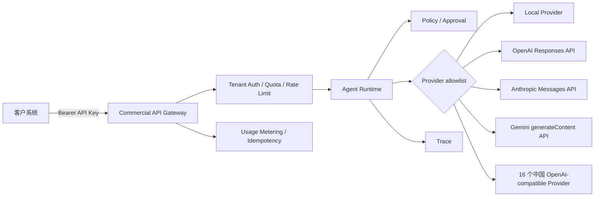

# 商业 API 接入与部署

商业 API 将内部 Agent Runtime 包装成一个稳定的多租户 REST 接口。外部客户只持有本系统签发的 API Key，不接触模型厂商密钥；服务端根据租户 allowlist 选择本地实现、国际模型 API 或中国模型厂商 API。

如果是第一次部署，请先按[商业 API 逐步配置手册](COMMERCIAL_SETUP_STEP_BY_STEP.md)完成环境、租户、密钥、模型、启动和验收配置。



厂商适配直接调用各厂商官方 HTTPS API：[OpenAI Responses](https://developers.openai.com/api/reference/resources/responses/methods/create)、[Anthropic Messages](https://docs.anthropic.com/en/api/messages)、[Gemini text generation](https://ai.google.dev/gemini-api/docs/text-generation)。

## 已实现的商业化基础能力

- Bearer API Key 多租户鉴权，密钥使用常量时间比较。
- 每个租户独立的 Domain、Task、Provider 和 Model allowlist。
- 内置 16 个中国模型 Provider，并统一转换为 Chat Completions 调用契约。
- 厂商密钥只从服务端环境变量读取，不进入请求、配置文件或 Trace。
- 单实例分钟级限流和持久化月请求配额。
- SQLite 用量计量：请求、输入 Token、输出 Token、总 Token 与延迟。
- `Idempotency-Key` 重放保护，避免客户重试造成重复执行。
- 写操作不接受客户自带批准；审批能力只能由可信服务端配置授予。
- 标准化错误码、`Retry-After` 和 `X-Request-ID`。
- 默认 256 KiB 的 HTTP 请求体上限，可通过 `VAF_MAX_REQUEST_BYTES` 调整。
- 自动生成 OpenAPI 文档：`/docs` 与 `/openapi.json`。

## 1. 安装

商业 API 建议使用 Python 3.12：

```powershell
python -m pip install -e ".[api]"
Copy-Item config/commercial.example.yaml config/commercial.yaml
```

不要直接在 YAML 中写任何真实密钥。先生成至少 32 字符的客户 API Key，再配置环境变量：

```powershell
$env:VAF_API_KEY_DEMO = "replace-with-a-long-random-customer-key"
$env:OPENAI_API_KEY = "..."     # 仅在启用 OpenAI 时设置
$env:ANTHROPIC_API_KEY = "..."  # 仅在启用 Anthropic 时设置
$env:GEMINI_API_KEY = "..."     # 仅在启用 Gemini 时设置
$env:DEEPSEEK_API_KEY = "..."   # 其他中国厂商同理
$env:VAF_COMMERCIAL_CONFIG = "config/commercial.yaml"
```

生产环境应使用云 Secret Manager、Vault 或容器 Secret 注入，不使用提交到仓库的 `.env` 文件。

## 2. 配置租户

`config/commercial.yaml` 的关键部分：

```yaml
tenants:
  - id: customer-a
    api_key_env: VAF_API_KEY_CUSTOMER_A
    allowed_domains: [research]
    allowed_tasks: [research.answer.query]
    allowed_providers: [local, openai]
    default_provider: local
    allowed_models:
      openai: [gpt-5.6-sol, gpt-5.6-terra, gpt-5.6-luna]
    default_models:
      openai: gpt-5.6-sol
    approved_capabilities: []
    rate_limit_per_minute: 60
    monthly_request_quota: 10000
```

模型名称只是租户 allowlist，应根据已经开通的厂商账户和成本策略维护。删除某个 Provider 或 Model 后，客户即使在请求里指定它也会收到 `403`。示例配置已按“能力、均衡、高速/低成本”保留每家厂商最多三个当前文本模型，完整目录、例外和月度更新办法见[模型前三档配置](MODEL_TIERS.md)。

`approved_capabilities` 默认必须为空。真实发布、付款、删改等操作应连接独立审批服务，不建议通过静态配置长期预批准。

## 3. 中国模型厂商对接清单

下表是截至 **2026-08-09** 已内置并完成接口路径探测的公开 OpenAI-compatible 文本生成平台。这里的“厂商”指能够申请商业 API 凭据、并公开兼容调用入口的平台；中国没有一个持续更新的“所有大模型厂商”官方名录，未公开标准商业 API 的实验室或仅提供私有化交付的模型不应伪装成已经接通。

所有地址最终会拼接 `/chat/completions`。厂商凭据仅从对应环境变量读取。

| `provider` | 厂商/平台 | 内置 Base URL | 密钥环境变量 | 官方资料与说明 |
| --- | --- | --- | --- | --- |
| `qwen` | 阿里云百炼 / Qwen | `https://dashscope.aliyuncs.com/compatible-mode/v1` | `DASHSCOPE_API_KEY` | [OpenAI 兼容文档](https://help.aliyun.com/zh/model-studio/compatibility-of-openai-with-dashscope)；新工作空间应设置 `DASHSCOPE_BASE_URL` |
| `deepseek` | DeepSeek | `https://api.deepseek.com` | `DEEPSEEK_API_KEY` | [API 文档](https://api-docs.deepseek.com/) |
| `zhipu` | 智谱 BigModel / GLM | `https://open.bigmodel.cn/api/paas/v4` | `ZHIPU_API_KEY` | [OpenAI SDK 兼容文档](https://docs.bigmodel.cn/cn/guide/develop/openai/introduction) |
| `moonshot` | Moonshot AI / Kimi | `https://api.moonshot.cn/v1` | `MOONSHOT_API_KEY` | [API 文档](https://platform.kimi.com/docs/api/overview)；国际账户可覆盖为 `https://api.moonshot.ai/v1` |
| `minimax` | MiniMax | `https://api.minimaxi.com/v1` | `MINIMAX_API_KEY` | [中国区 API 文档](https://platform.minimaxi.com/docs/api-reference/api-overview)；国际区为 `api.minimax.io` |
| `doubao` | 火山方舟 / 豆包 | `https://ark.cn-beijing.volces.com/api/v3` | `ARK_API_KEY` | [兼容 OpenAI SDK 文档](https://www.volcengine.com/docs/82379/1330626)；`model` 通常填写方舟 Endpoint ID |
| `hunyuan` | 腾讯混元 | `https://api.hunyuan.cloud.tencent.com/v1` | `HUNYUAN_API_KEY` | [OpenAI 兼容接口文档](https://cloud.tencent.com/document/product/1729/111007) |
| `qianfan` | 百度智能云千帆 | `https://qianfan.baidubce.com/v2` | `QIANFAN_API_KEY` | [千帆文档中心](https://cloud.baidu.com/doc/Qianfan/index.html)；使用兼容接口专用 API Key |
| `stepfun` | 阶跃星辰 StepFun | `https://api.stepfun.ai/v1` | `STEPFUN_API_KEY` | [API 文档](https://platform.stepfun.ai/docs) |
| `yi` | 零一万物 / Yi | `https://api.lingyiwanwu.com/v1` | `YI_API_KEY` | [开放平台文档](https://platform.lingyiwanwu.com/docs) |
| `baichuan` | 百川智能 | `https://api.baichuan-ai.com/v1` | `BAICHUAN_API_KEY` | [开放平台文档](https://platform.baichuan-ai.com/docs) |
| `spark` | 科大讯飞星火 | `https://maas-token-api.cn-huabei-1.xf-yun.com/v2` | `SPARK_API_KEY` | [星辰 Token Plan](https://www.xfyun.cn/doc/spark/TokenPlan.html)；使用套餐专属 API Key，支持 X2 Agent、X2、X2 Flash 三档 |
| `siliconflow` | SiliconFlow | `https://api.siliconflow.cn/v1` | `SILICONFLOW_API_KEY` | [Chat Completions 文档](https://docs.siliconflow.cn/cn/api-reference/chat-completions/chat-completions)；模型 ID 常带组织前缀 |
| `sensenova` | 商汤日日新 SenseNova | `https://api.sensenova.cn/compatible-mode/v1` | `SENSENOVA_API_KEY` | [开放平台](https://platform.sensenova.cn/) |
| `mimo` | 小米 MiMo | `https://api.xiaomimimo.com/v1` | `MIMO_API_KEY` | [开放平台文档](https://platform.xiaomimimo.com/#/docs) |
| `longcat` | 美团 LongCat | `https://api.longcat.chat/openai/v1` | `LONGCAT_API_KEY` | [开放平台文档](https://longcat.chat/platform/docs) |

### 3.1 模型目录为什么需要定期更新

示例配置已锁定 2026-08-09 的官方模型目录，但厂商仍会持续发布、下线或重定向模型，有些平台还使用账户专属部署 ID。生产配置必须定期复核，并把确认可用的最多三档模型放进租户 `allowed_models`：

```yaml
providers:
  deepseek:
    api_key_env: DEEPSEEK_API_KEY
  doubao:
    api_key_env: ARK_API_KEY

tenants:
  - id: customer-a
    # 其余租户字段省略
    allowed_providers: [local, deepseek, doubao]
    allowed_models:
      deepseek: [deepseek-v4-pro, deepseek-v4-flash]
      doubao: [doubao-seed-evolving, doubao-seed-2.1-pro, doubao-seed-2.1-turbo]
    default_models:
      deepseek: deepseek-v4-pro
```

外部请求同时受到 Provider 与 Model 两层 allowlist 约束。即使服务端配置了厂商密钥，租户未获得该 Provider 或 Model 权限时仍返回 `403`。

### 3.2 阿里云地域/Workspace 地址

新的阿里云百炼工作空间可能要求专属地址，例如：

```powershell
$env:DASHSCOPE_BASE_URL = "https://WORKSPACE_ID.cn-beijing.maas.aliyuncs.com/compatible-mode/v1"
```

代码只接受 HTTPS，并校验阿里云官方主机后缀。类似的 Base URL 覆盖不能指向任意服务器，防止配置错误演变为 SSRF。

### 3.3 调用中国 Provider

客户仍然调用同一个商业 API，只改变 `provider` 和 `model`：

```json
{
  "domain": "research",
  "task": "research.answer.query",
  "input": {"query": "shared Harness"},
  "provider": "deepseek",
  "model": "deepseek-v4-pro"
}
```

服务端将请求转换为厂商兼容的 `messages`、`max_tokens` 和非流式 Chat Completions 请求，再把 `choices[0].message.content` 与厂商 Token 用量统一为 `ModelResult`。厂商原始错误正文不会返回客户。

### 3.4 没有列出的中国模型

没有公开 OpenAI-compatible 商业端点、需要云 IAM 签名、只提供私有化部署或仅提供网页聊天的模型，不能直接套用此适配器。接入这类平台时应新增专用 `BaseModelProvider`，并为鉴权、请求格式、响应解析和用量字段编写契约测试；不要通过允许客户提交任意 `base_url` 来“通配”接入。

## 4. 启动服务

```powershell
vertical-agent-api
```

默认只监听 `127.0.0.1:8000`。本地查看：

- Health：<http://127.0.0.1:8000/v1/health>
- Swagger UI：<http://127.0.0.1:8000/docs>
- OpenAPI：<http://127.0.0.1:8000/openapi.json>

## 5. 调用 Agent

使用本地 Provider：

```powershell
$headers = @{
  Authorization = "Bearer $env:VAF_API_KEY_DEMO"
  "Idempotency-Key" = "order-20260808-001"
}
$body = @{
  domain = "research"
  task = "research.answer.query"
  input = @{ query = "shared Harness" }
} | ConvertTo-Json -Depth 5

Invoke-RestMethod -Method Post `
  -Uri "http://127.0.0.1:8000/v1/agent/runs" `
  -Headers $headers -ContentType "application/json" -Body $body
```

选择租户允许的官方模型：

```json
{
  "domain": "research",
  "task": "research.answer.query",
  "input": {"query": "shared Harness"},
  "provider": "openai",
  "model": "gpt-5.6-sol"
}
```

外部模型只替换 `research.answer.synthesize` 的 Capability 实现。证据搜索、Policy、证据校验、Trace 和 Eval 仍由共享 Harness 执行。

## 6. 查询模型与用量

```powershell
Invoke-RestMethod -Uri "http://127.0.0.1:8000/v1/models" -Headers $headers
Invoke-RestMethod -Uri "http://127.0.0.1:8000/v1/usage" -Headers $headers
```

`/v1/models` 只返回当前租户可用的 allowlist，不泄露厂商密钥。`/v1/usage` 返回本月请求量和厂商报告的 Token 数。它是计量基础，不包含价格；实际账单应由支付系统结合版本化价目表计算。

## 7. Docker 部署

```powershell
docker build -f Dockerfile.api -t vertical-agent-api .
docker run --rm -p 8000:8000 `
  -v "${PWD}/config/commercial.yaml:/app/config/commercial.yaml:ro" `
  -e VAF_API_KEY_DEMO `
  -e OPENAI_API_KEY `
  vertical-agent-api
```

容器以非 root 用户运行，运行数据写入 `/app/.commercial` 与 `/app/.runs`。生产环境应挂载持久卷。

## 8. 错误语义

| HTTP | code | 含义 |
| --- | --- | --- |
| 401 | `unauthorized` | 缺少或使用了错误 API Key |
| 403 | `domain_forbidden` / `task_forbidden` | 租户无权调用该资产 |
| 403 | `provider_forbidden` / `model_forbidden` | 厂商或模型不在 allowlist |
| 409 | `approval_required` | 写操作缺少服务端批准 |
| 409 | `idempotency_conflict` | 同一幂等键对应了不同请求 |
| 413 | `request_too_large` | 请求体超过服务端限制 |
| 429 | `rate_limit_exceeded` | 超过分钟调用频率 |
| 429 | `quota_exceeded` | 超过月请求配额 |
| 502 | `agent_execution_failed` | Agent 或上游 Provider 执行失败 |

API 不向客户返回厂商原始错误正文，避免提示词、证据或敏感数据被上游错误响应再次泄露。使用 `X-Request-ID` 和服务端 Trace 排查。

## 9. 正式商业化前的基础设施升级

当前实现是可运行的单实例商业 API 基线。面向公网和多副本部署前还需要：

1. 在负载均衡器或 API Gateway 强制 HTTPS、请求体大小限制、WAF 和 IP 风控。
2. 将内存限流迁移到 Redis，将 SQLite 用量库迁移到 PostgreSQL 等共享数据库。
3. 接入 API Key 创建、轮换、吊销和客户控制台，不让运维手工长期管理密钥。
4. 将请求计量接入版本化定价、账单、余额、退款与财务对账。
5. 为长任务增加队列、异步 Run 状态查询、取消、超时和 Webhook 签名。
6. 根据业务所在地完成数据保留、隐私、内容安全、模型供应商条款和审计要求。
7. 对真实写操作接入带身份、范围、时效和一次性令牌的审批服务。
