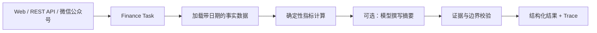

# 金融分析 Agent 与微信公众号接入手册

本文从零说明如何运行金融宏观、A 股、美股研究 Agent，如何切换到官方数据 API，以及如何把被动问答入口接到微信公众号。

> 重要边界：本系统只做一般性研究与信息整理，不提供个性化投资建议、目标价、收益承诺、自动下单或代客交易。所有回答都应保留数据日期、来源和免责声明。

## 1. 系统能做什么

金融 Domain Pack 提供四类任务：

| 任务 ID | 用途 | 风险等级 | 默认行为 |
|---|---|---:|---|
| `finance.macro.analyze` | 中国、美国或全球宏观指标分析 | 只读 | 自动执行 |
| `finance.a_share.analyze` | A 股日线、区间收益、历史波动率、最大回撤 | 只读 | 自动执行 |
| `finance.us_stock.analyze` | 美股日线与相同风险指标 | 只读 | 自动执行 |
| `finance.briefing.publish` | 发布金融简报 | 高风险写入 | 必须审批 |

执行链如下：



模型厂商与行情厂商是两组独立配置：

- 模型厂商只负责把已经计算好的事实和指标写成自然语言；不选模型也能运行。
- 行情厂商提供事实数据。Tushare 用于 A 股和中国宏观，FRED 用于美国宏观，Alpha Vantage 用于美股日线。
- 所有区间收益、历史波动率、最大回撤都由本地确定性代码计算，避免模型心算漂移。

## 2. 安装并先用样例数据跑通

要求 Python 3.7+。在仓库根目录执行：

```powershell
python -m pip install -e ".[api,api-test]"
python -m vertical_agent_factory.cli --root . validate --domain finance
python -m vertical_agent_factory.cli --root . eval --domain finance
```

默认 `fixture` 模式无需任何数据密钥。分别运行：

```powershell
# 全球宏观
python -m vertical_agent_factory.cli --root . run --domain finance `
  --task finance.macro.analyze --input "region=global"

# A 股，纯数字代码会自动补交易所后缀
python -m vertical_agent_factory.cli --root . run --domain finance `
  --task finance.a_share.analyze --input "symbol=600000"

# 美股
python -m vertical_agent_factory.cli --root . run --domain finance `
  --task finance.us_stock.analyze --input "symbol=AAPL"
```

正常结果应包含：`status`、`as_of`、`facts`、`inferences`、`evidence`、`warnings`、`disclaimer`。无效代码或数据不足时应返回 `INSUFFICIENT_EVIDENCE`，而不是补造价格。

## 3. 无代码配置

启动 Web UI：

```powershell
cd web
pnpm install
pnpm run dev
```

打开 `/setup` 后按下面步骤操作：

1. 在“业务用途”勾选金融宏观、A 股、美股中的所需任务。只有确实需要发布简报时才勾选发布任务。
2. 在“选择厂商”选择用于生成自然语言摘要的模型厂商；也可以完全不选，使用本地确定性流程。
3. 在“密钥与模型”选择金融数据模式。首次部署建议使用“内置样例”。
4. 若选择“真实数据”，按页面提示填写 Tushare Token、FRED API Key、Alpha Vantage API Key。
5. 在“权限与额度”生成客户 API Key，设置每分钟和每月额度；按需启用微信公众号。
6. 在最后一步复制一次性本地配置服务命令，先点击“后台检查”，通过后再点击“应用到本机”。
7. 重启 API 服务使配置生效。

页面会把非秘密权限写入 `config/commercial.yaml`，把真实密钥写入被 Git 忽略的 `.env`。不要截图、转发或提交 `.env`。

## 4. 申请并配置官方数据 API

### 4.1 Tushare：A 股与中国宏观

1. 注册 Tushare Pro 账号并在个人中心取得 Token。
2. 确认账号积分或套餐允许调用 `daily` 与 `cn_gdp` 接口。
3. 在 `.env` 写入：

```dotenv
VAF_FINANCE_DATA_MODE=live
TUSHARE_TOKEN=替换为真实Token
```

Tushare 的 HTTP 请求采用 JSON POST，包含 `api_name`、`token`、`params` 和 `fields`。系统只把 Token 放在请求体与本地环境变量中，并使用 HTTPS。接口格式见 [Tushare 官方 HTTP API 文档](https://tushare.pro/document/1?doc_id=130)，A 股日线参数见 [Tushare 官方日线行情文档](https://tushare.pro/document/2?doc_id=27)，中国 GDP 见 [Tushare 官方中国 GDP 文档](https://tushare.pro/document/2?doc_id=227)。

### 4.2 FRED：美国宏观

1. 创建 FRED 账号并申请 API Key。
2. 在 `.env` 写入：

```dotenv
FRED_API_KEY=替换为真实Key
```

系统读取 `GDPC1`、`CPIAUCSL`、`UNRATE`、`FEDFUNDS` 等序列，按观测日期倒序获取最新与前值。参数和返回格式见 [FRED 官方 series/observations 文档](https://fred.stlouisfed.org/docs/api/fred/series_observations.html)。

### 4.3 Alpha Vantage：美股日线

1. 在 Alpha Vantage 申请 API Key。
2. 确认免费或商业套餐的频率、实时性与再分发授权满足你的用途。
3. 在 `.env` 写入：

```dotenv
ALPHAVANTAGE_API_KEY=替换为真实Key
```

系统调用 `TIME_SERIES_DAILY` 并使用 compact 输出计算研究指标。字段与频率限制见 [Alpha Vantage 官方 API 文档](https://www.alphavantage.co/documentation/)。商业化前必须根据自己的客户、地区和展示方式核对各数据厂商许可；接入能力不等于取得再分发权。

### 4.4 完整环境变量示例

```dotenv
VAF_FINANCE_DATA_MODE=live
TUSHARE_TOKEN=替换为真实Token
FRED_API_KEY=替换为真实Key
ALPHAVANTAGE_API_KEY=替换为真实Key
```

只启用某类任务时可以只配置需要的密钥：

- 仅 A 股：Tushare。
- 仅美股：Alpha Vantage。
- 全球宏观：Tushare + FRED。
- 样例模式：均不需要。

## 5. 通过商业 REST API 调用

先按照[商业 API 接入与部署](COMMERCIAL_API.md)创建租户。租户必须包含 `finance` Domain 与对应任务白名单。

```yaml
tenants:
  - id: finance-demo
    api_key_env: VAF_API_KEY_FINANCE_DEMO
    allowed_domains:
      - finance
    allowed_tasks:
      - finance.macro.analyze
      - finance.a_share.analyze
      - finance.us_stock.analyze
    allowed_providers:
      - local
    default_provider: local
```

启动服务：

```powershell
vertical-agent-api
```

调用 A 股分析：

```powershell
$headers = @{
  Authorization = "Bearer $env:VAF_API_KEY_FINANCE_DEMO"
  "Idempotency-Key" = "a-share-600000-20260815"
}
$body = @{
  task = "finance.a_share.analyze"
  input = @{ symbol = "600000" }
  provider = "local"
} | ConvertTo-Json -Depth 5
Invoke-RestMethod -Method Post -Uri http://127.0.0.1:8000/v1/agent/runs `
  -Headers $headers -ContentType "application/json" -Body $body
```

如果选择已配置的外部模型 Provider，模型只能在同一事实结果上生成说明文字；Domain、Task、Provider、Model 仍受租户白名单限制。

## 6. 接入微信公众号

### 6.1 前提

- 一个可配置服务器地址的微信公众号。
- 一个公网可访问的 HTTPS API 域名。Web UI 静态站点地址不能代替后端 API。
- API 服务可以稳定返回微信请求；被动回复应尽量在 5 秒内完成。
- 一个随机 Token，建议 32 字节以上。Token 不是 AppID、AppSecret 或 EncodingAESKey。

### 6.2 服务端配置

在 `.env` 中增加：

```dotenv
WECHAT_OFFICIAL_ACCOUNT_TOKEN=替换为至少16字符的随机值
VAF_WECHAT_TENANT_ID=finance-demo
VAF_WECHAT_FINANCE_DATA_MODE=fixture
VAF_WECHAT_MAX_BODY_BYTES=65536
```

说明：

- `VAF_WECHAT_TENANT_ID` 指定公众号请求使用哪个商业 API 租户。该租户必须允许金融任务。
- `VAF_WECHAT_FINANCE_DATA_MODE` 默认建议 `fixture`，可避免外部数据 API 延迟导致微信超时。
- 改成 `live` 前应增加缓存、超时预算与降级策略，并实测响应时间。
- 当前仅支持明文模式。若微信平台选择兼容或安全模式，服务会明确返回“不支持加密”，不会误解析密文。

重启 `vertical-agent-api` 后，回调端点为：

```text
https://你的API域名/v1/channels/wechat/official-account
```

### 6.3 微信公众平台配置

1. 登录[微信公众平台](https://mp.weixin.qq.com/)。
2. 进入“设置与开发”或“开发”下的“基本配置 / 服务器配置”。不同账号类型的菜单名称可能略有差异。
3. URL 填写上面的完整 HTTPS 回调地址。
4. Token 填写与 `WECHAT_OFFICIAL_ACCOUNT_TOKEN` 完全相同的值。
5. 消息加解密方式选择“明文模式”。当前版本不使用 EncodingAESKey。
6. 点击提交。微信会发送带 `signature`、`timestamp`、`nonce`、`echostr` 的 GET 请求；系统按官方规则排序 Token、timestamp、nonce 后计算 SHA-1，并在校验通过时原样返回 `echostr`。
7. 验证成功后启用服务器配置。

微信服务器配置流程见[微信公众号官方接入概述](https://developers.weixin.qq.com/doc/offiaccount/Basic_Information/Access_Overview.html)，消息字段见[官方接收普通消息文档](https://developers.weixin.qq.com/doc/offiaccount/Message_Management/Receiving_standard_messages.html)，被动回复格式见[官方被动回复用户消息文档](https://developers.weixin.qq.com/doc/offiaccount/Message_Management/Passive_user_reply_message.html)。

### 6.4 用户命令

| 用户发送 | 系统任务 |
|---|---|
| `宏观 中国` | `finance.macro.analyze`，region=`china` |
| `宏观 美国` | `finance.macro.analyze`，region=`us` |
| `宏观 全球` | `finance.macro.analyze`，region=`global` |
| `A股 600000` | `finance.a_share.analyze`，自动规范化证券代码 |
| `美股 AAPL` | `finance.us_stock.analyze` |
| `帮助` | 返回命令说明 |

每条文本消息使用微信 `MsgId` 生成幂等键，避免微信重试造成重复 Agent 运行。回复始终包含研究边界声明。

### 6.5 反向代理示例

生产环境可用 Nginx 把公网 HTTPS 请求转发到本地 API：

```nginx
location /v1/channels/wechat/official-account {
    proxy_pass http://127.0.0.1:8000;
    proxy_set_header Host $host;
    proxy_set_header X-Forwarded-Proto https;
    proxy_connect_timeout 2s;
    proxy_read_timeout 4s;
}
```

证书、域名备案、网络策略和日志脱敏应按实际部署地区与组织制度处理。

## 7. 上线前测试

```powershell
# 全量 Python 测试
python -m pytest -q

# 两个领域分别校验与评测
python -m vertical_agent_factory.cli --root . validate --domain research
python -m vertical_agent_factory.cli --root . eval --domain research
python -m vertical_agent_factory.cli --root . validate --domain finance
python -m vertical_agent_factory.cli --root . eval --domain finance

# Web UI
cd web
pnpm run lint
pnpm test
```

微信公众号至少要验证：

1. 正确 Token 可以通过 GET 服务器校验，错误签名返回 403。
2. 五类命令都能收到文本回复。
3. 非文本消息或不支持的命令给出帮助信息。
4. XML 中的 DTD / Entity 被拒绝，超大请求体被拒绝。
5. 数据 API 故障时返回安全降级消息和免责声明。
6. 重复 `MsgId` 不会造成重复运行或发布。
7. 公众号租户无法调用未授权任务、Provider 或模型。

## 8. 生产化建议

- 先保持公众号 `fixture` 或缓存数据模式，把在线数据抓取放到定时任务中；被动回复只读取缓存。
- 在取得微信消息加密要求后实现并审计安全模式，再切换平台配置。
- 使用 Secret Manager，不把数据密钥、模型密钥、微信 Token 写入镜像或 Git。
- 金融数据必须保存来源、许可、抓取时间、市场时区和复权口径。
- 对模型输出做持续 Eval，尤其检查虚构数据、个性化建议、收益承诺和提示词注入。
- 主动群发、付费订阅、交易连接属于新的高风险能力，必须单独建 Capability、Policy、审批和合规审查；当前实现没有开放这些能力。
